### What is the minimum visible distance of the L/P plate that permit holders must display? 

___

20 m 

### What is the allowed BAC level for L holders? 

___

0 

### What is the allowed BAC level for P1 holders? 

___
0

### What is the allowed BAC level for P2 holders? 

___
0 

### What is the allowed BAC level for Full License holders? 

___
0.05

### Can learner permit holders drive without a supervisor? 

___
No

### Who (L/P1/P2/Full License holders) must carry their license with them when driving?

___
- L/P1/P2 
- Full license if age < 26

### When must a Full License holder carry their driving license when driving? 

___
If age is under 26

### What is the policy regarding the use of GPS or handheld or mounted mobile device for L/P1/P2?

___
- Cannot touch 
- Cannot use voice control
- If want to use for navigation or streaming audio, must set up before driving.
- Scrolling, entering numbers and texts are not permitted unless parked.

### What is the policy regarding the use of GPS or handhell or mounted mobile device for Full License?

___
- Cannot use while driving 
- Cannot message, use social media, watch movies, play video games, call or other moving images 
- Entering text, numers and scrolling are not permitted unless parked.

### Can learner permit holders tow a car? 

___
No 

### Can learner permit holders drive a bus or truck? 

___
No 

### When can P1/P2 holders drive a vehicle fitted with an automatic transmission? 

___
If they passed the drive test in a vehicle fitted with an automatic transmission.

### Can P1 holders drive probationary prohibited vehicle? 

___
Generally no but yes in certain cases 

### Can P2 holders drive probationary prohibited vehicle? 

___
Generally no but yes in certain cases 

### When can P1 holders drive probationary prohibited vehicle?

___
- During work hours
- Requested by employers 
- Has a written exception granted by VicRoads
- Or while being supervised by a full license holder sitting beside the driver 

### When can P2 holders drive probationary prohibited vehicle?

___
- During work hours
- Requested by employers 
- Has a written exception granted by VicRoads
- Or while being supervised by a full license holder sitting beside the driver 

### Can P1 holders drive a caravan, trailer or another vehicle? 

___
Generally no but yes in certain cases

### When can P1 holders drive a caravan, trailer or another vehicle? 

___
- For work 
- Requested by employers 
- Or for agriculture, horticulture, dairying, pastoral or commercial fishing
- Or under supervision of a full license holder authorised to drive that vehicle who is sitting beside the driver 

### How many passengers aged between 16 and 22 can P1 holders carry? 

___
No more than 1 unless exempt.

### When can P1 holders carry more than 1 passenger aged between 16 and 22? 

___
- Carrying family members 
- With a fully licensed supervising driver 
- When driving an emergency vehicle

### Can P2 holders tow a caravan or trailer? 

___
Yes 

### How many passengers aged between 16 and 22 can P2 holders carry?

___
As many that can fit into the vehicle

### When is the risk of being killed or injured in a crash the highest?

___
First few months and years of driving (new P plate drivers)

### At what age/license group is the risk of being involved in a crash the lowest? 

___
Learners

### Why does VicRoads have special requirements for new drivers and a Graduated Licensing System (GLS)?

___
Because new P plate drivers have the highest crash risk.

### Why does VicRoads have a four year probationary period for new drivers? 

___
Because crash risk decreases with age and experience, but for the first few years, the risks are still relatively high.

### What are the different challenges of safe driving (9 items)?

___
- Different traffic conditions - ligh traffic in local street/heavy peak hour traffic in busy highways.
- Rural and country roads. 
- Extremes in weather - rain/fog/ice
- Different driving manoeuvres in busy traffic - roundabouts, changing lanes or turning at different intersections 
- Poor visibility - nigh driving/sun glare
- Unexpected actions of other road users - stopping quickly, merging or turnining without warning, pedestrians rushing onto the road without looking 
- Different type of roads - freeways, divided and undivided highways, main roads, gravel roads, roads with trams
- Bad road surfaces - potholes, gravel or slippery surfaces 
- Any of these challenges when there are distractions inside the car - radio/ passengers/ mobile phones or other electronic devices.

### What are the different crash types that new drivers are likely to be involved in (4 types)? 

___
- Crashes when losing control and driving off roads, most often in straight roads 
- Crashes at intersection when turning right in front of an oncoming vehicle 
- Crahses at intersection when hit by a right turning vehicle
- Crashes into the rear of another vehicle 

### What are the causes of crashes (7 causes)?

___
- Misjudge gaps in traffic 
- Drive too fast for the conditions 
- Drive too close to the other cars 
- Not recognising potential hazards 
- Distracted
- Do not look further ahead than the car infront 
- Take risks

### What is a head check? 

___
Looking over shoulder to see things through the rear side windows

### Are the mistakes that new drivers make due to poor car control skills? 

___
No but due to lack of experience - poor responses to the roads and other drivers 

### What is the best way for new driver to reduce the risk of crashing?

___
120 hours of supervised driving 

### What is the approximate reduction in crash risk between drivers with 120 hours of driver experience and drivers with 50 hours of experience? 

___
30% reduction

### What is hazard perception? 

___
The ability to anticipate potential hazards and risky situations. 

### How are hazard perception skills developed? 

___
With experiences driving in different driving situations.

### Do cars have blindspots? 

___
Yes, outside the rear doors for instance.

### How do drivers see in these blind spots? 

___
Perform head check and use mirrors - constantly scan.

### What is road scanning? 

___
Look into the side mirrors, rear mirrors and ahead to anticipate hazards. 

### How should side mirrors be positioned?

___
Catch the view of the edge of the car - be able to see the rear door handle in the corner of the side mirror.

### How can supervising driver help? 

___
- Extra pair of eyes to watch the road
- Help making some difficult decisions 
- Help anticipate potential hazards

### How long should practice periods be? 

___
10, 20, 30 minutes or an hour. Frequent short rides are better than a few long drives. 

### What to do if brakes fail?

___
- Pump on break pedal hard and fast.
- Apply handbrake carefully so the vehicle doesn't skid
- Change to lower gear and use horn to alert other drivers
- Try to steer to avoid severe collision

### How to know that you have improved your skills 

___
- Car control becomes smooth 
- Making fewer mistakes 
- Better at low speed actions like reversing car in driveway or driving into and out of angled parking bays
- Better at anticipating hazards - supervising drivers will not have to point things out as often
- Rely less and less on suggestions from supervising driver

### What can increase the risk of crashing or seriously hurt for drivers (8 points)? 

___
- Driving under influence of alcohol or drugs.
- Speeding.
- Using mobile phones and other electronic devices. 
- Having passengers in the car.
- Other distractions inside or outside the car.
- Fatigue - driving when tired.
- Not wearing seatbells.
- Poor vehicle maintenance.

### What is the approximate increase in crash risk when BAC is 0.05 compared to when BAC is 0?

___
Double the risk 

### What are the penalties for driver with a drink driving offence? 

___

- Licence cancelled.
- Complete a Behavior Change Program
- Install and use an alcohol interlock device for at least 6 months.

### Can alcohol remain in your system for some time after you finish drinking? 

___

Yes. BAC can be > 0 the morning after drinking.

### Is there any exception to driving under alcohol influence? 

___

No 

### Is there any exception to driving when under drug influence? 

___

No 

### Which of the following affect your driving the most? 

- [ ] Taking alcohol.
- [ ] Taking drug.
- [ ] Mixing alcohol and drug.

___

Mixing alcohol and drug

### Can over-the-counter medicine and other prescriptions affect your driving ability? 

___ 

Yes

### What should you do if you need to go home after drinking? 

___

- Don't drive by yourself (public transport/taxi/other drivers).
- Stay

### What is the approximate percentage of crash cases where speeding is a factor? 

___

- 20% of fatal crashes 
- 30% of crashes involving only 1 vehicle - i.e. driving into trees, off the road, etc.

### How does speeding affect safe driving? 

___

- Less time to scan the road and identify hazards.
- Less time to react/make the right decision.

### Why is using mobile phone or electronic devices while driving deemed dangerous? 

___

- Distraction - take eyes and mind off the road.

### Are older, more experienced drivers with full license allowed to use mobile phone or electronic devices while driving? 

___ 
No

### What interactions with phone and other device are permitted for learner, p1 and p2 holders before or during driving? 

___
- Set up before driving 
- For streaming audio music or GPS
- If mounted correctly

### What interactions with phone and other device are prohibited for learner, p1 and p2 holders before or during driving? 

___
- Cannot touch, enter text or number while driving.
- Cannot use voice control.
- Cannot change audio.
- Cannot interact with text messages in any way.
- Cannot put on the lap.
- Cannot pass to other passenger.

### What interactions with phone and other device are permitted for full license holder? 

___
- Make or receive calls using voice command
- Must be securely mounted

### What interactions with phone and other device are prohibited all drivers? 

___
- Cannot use device for messaging, entering text numbers and scrolling.
- Cannot rest device on lap.
- Cannot pass device to passengers.

### What should you do if you need to make or receive a call? 

___
- Pull over safely and park
- Do not stop in emergency lane - illegal.

### How can fatigue affect drivers? 

___
- Fall asleep at the wheel.
- Slow reflexes, attention, judgement.

### When can fatigue happen? 

___
- Driving when usually sleeping.
- Not enough sleep.
- Awake for too long.
- Drive right after waking up.
- Drive for more than 2 hours non-stop.

### Does having coffee or taking short break stop fatigue? 

___
No. The only way to stop being fatigued is to get enough sleep.

### How to reduce the effect of fatigue?

___
- Don't drive at time when usually asleep.
- Don't drive right after waking up.
- Don't drive continuously for more than 2 hours without taking rest.
- Ensure you don't take medicines that can cause drownsiness before or during driving. 
- Pull over, park the car and take a short rest when you notice fatigue signs.

### How to reduce the effect of fatigue on a long trip? 

___
- Get plenty of sleep before the trip.
- Share the wheel with other drivers. 
- Take regular breaks.
- Avoid time when you are normally asleep.
- Don't start a trip if you have been awake for very long or if you haven't slept for a long time. 

### Are crashes more likely for a short or for a long journey?

___
Most crashes happen on short journey.

### If you only need to travel a short distance, do you need to wear seatbells? 

___
Yes, as most crashes happen on short journey.

### How does wearing seatbell help in a crash? 

___
- During a crash, driver and passengers without seatbells can be thrown across the window outside the car.
- People not wearing seatbells can also be thrown against other objects inside the car - windows, windscreen, other passengers, etc.
- Fatality rate increases over 25 times for people thrown outside the car compared to people remaining inside.

### Do passengers need to wear seatbells? 

___
Yes 

### What happen to drivers if passengers do not wear seatbell?

___
Fined with demerit points.

### How can children under 7 yearsold wear seatbell? 

___
Use child restraint.

### What happen to passenger not wearing seatbell?

___
Passengers over 16 yearsold get fined for not wearing seatbell when driving.

### Can any part of passenger's body be put outside the door or window? 

___
No and it is illegal to do so. - Drivers will get fined and receive demerit points. 

### What are the most important safety features in a car? 

___
- Airbags
- Electronic Stability Control

### What websites can be used to assess the safety rating of cars ?

___
- howsafeisyourcar.com.au
- ancap.com.au

### What maintenance work need to be done? 

___
- Tyre pressure and tread depth.
- Regular maintenance by experts.

### What to do when you have a tyre blowout when driving? 

___
- Keep a firm grip on steering wheel
- Take foot off accelerator
- Break gently once you feel the vehicle is under some control

### What to do in an emergency stop with an Antilock Braking System? 

___
- Keep firm pressure on brake pedal

### What are the strategies to reduce crash risk? 

___
- Choose when and where to drive
- Slow down
- Give yourself some space - leave safe margin.
- Think ahead - don't just focus on the vehicle in front. 
- Drive safely at night.
- Drive safely on country roads 
- Deal with other road users
    

### What is a safe distance margin?

___
- At least 2 seconds.

### When is a more than 2 second gap recommended? 

___
- For new drivers
- Distracting conditions
- Poor visibility 
- Slippery road
- Heavy load
- Gravel road

### What is the minimum distance margin between two long vehicles (trailer > 7.5 m long)?

___
- 60 m except built-up area or on multi-lane road
- 200 m in a road train area.

### What is a build up area?

___
One with buildings next to the road or street lights.

### What are the strategies to deal with other road users? 

___ 

- Use indicators 
- Allow space between your car and the one in front of you
- Control speed in a smooth manner rather than a fast stop/start manner 
- Stay in left lane except when passing 
- Keep intersections clear
- Let other people merge into the traffic 
- Change langes correctly 
- Slow down when approaching roadwork

### What to do to keep cool when driving? 

___
- Plan trip accordingly, allowing for time to get to destination
- If running late, call ahead of time
- Avoid driving if angry, tired or stressed

### When should you flash or headlights or use the horn? 

___
Warn other drivers about a dangerous situation.

### What are eco driving techniques? 

___

- Avoid hard or unnecessary acceleration and severe braking.
- Decelerate smoothly by releasing the accelerator.
- Don't take off too fast.
- Slow down and maintain a steady speed (90km/h uses 25% less fuel than 110 km/h).

### What are the impacts of alcohol on driving? 

___
- Overconfident and take risk
- Unaware of driving impairment
- Slower reflex
- Poorer coordination
- Less able to handle emergency situations
- Less able to process information

### Factors affecting BAC 

___
- Gender 
- Body size
- Food consumption - food slows down alcohol absorption
- Rate of drinking - drink quickly - higher BAC 
- Type of alcohol 
- General health - liver problem - higher BAC 
- Use of drug - higher BAC

### What can reduce BAC level? 

___
Only time, no other factor like showering, coffee or quick nap

### Must children wear seatbell? 

___
Yes 

### Must pregnant women wear seatbell? 

___
Yes 

### Are drivers responsible for the restraints of passengers? 

___
Yes. If passengers don't wear seatbell, driver can be fined and receive demerit points.

### What are the correct seatbell use? 

___
- Over shoulder 
- Across chest
- Buckled on hip

### How should pregnant women wear seatbell? 

___
Lap part across hip and below the belly 

### How should animals be transported on a car? 

___
- Must not be on your lap 
- Tethered in a way to prevent them from falling off 

### What does speed limit signs tell your? 

- [ ] Maximum permitted speed
- [ ] Minimum permitted speed 

___ 
Maximum permitted speed in good conditions 

### What is the speed limit of build up areas without any sign?

- [ ] 40 km/h
- [ ] 50 km/h
- [ ] 60 km/h
___
50 km/h unless the sign says otherwise

### What is the speed limit outside build up areas and on freeways without signs? 

- [ ] 60 km/h
- [ ] 90 km/h
- [ ] 100 km/h

___
100 km/h unless the sign says otherwise 

### What does this sign tell you? 

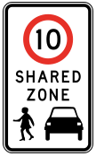

___
- Speed limit is 10 km/h
- Must give way to pedestrian

### What does this sign tell you?

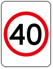

___
- Permanent speed limit 
- Maximum 40 km/h

### What does this sign tell you?

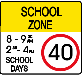
___
- Time based speed limit 
- Speed limit of 40 km/h applies at the hours on sign

### What does this sign tell you? 

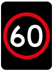

___
- Time based speed limit 
- Electronic 
- Speed limit of 60 km/h applies until changed.

### What happen to stopping distance if your speed is doubled? 

___
When speed doubles, stopping distance increases by 4 times

### What is the stopping distance when you are travelling at 60km/h?

___
67 km/h

### What is the stopping distance when you are travelling at 100 km/h? 

___
142 km/h

### What does this sign tell you? 

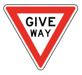

___ 
Drivers must give way to other vehicles

### What does this sign tell you? 

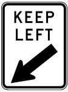

___ 
Must keep to the left side of the road

### What does this sign tell you? 

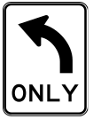

___ 
Can only turn left

### What does this sign tell you? 

___ 
No entry

### What does this sign tell you? 

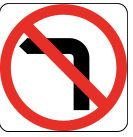

___ 
Cannot turn left

### What does this sign tell you? 

___ 
Pedestrian crossing 

### What does this sign tell you? 

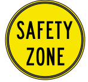

___ 
Safety zone

### What does this sign tell you? 

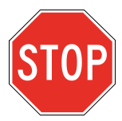

___ 
Drivers must stop

### What does this sign tell you? 

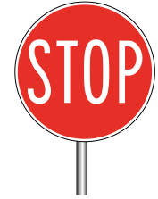

___ 
Drivers must stop

### What does this sign tell you? 

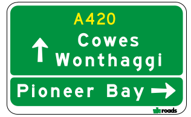

___ 
- Travelling on A420
- Cowes ad Wonthaggi ahead
- Turn right to Pioneer Bay

### What does this sign tell you? 

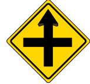

___ 
cross road intersection ahead

### What does this sign tell you? 

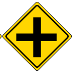

___ 
cross road intersection ahead

### What does this sign tell you? 

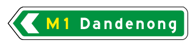

___ 
travelling on M1 to Dandenong

### What does this sign tell you? 

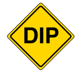

___ 
hollow/dip in the road 

### What does this sign tell you? 

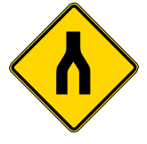

___ 
Merging of split road ahead

### What does this sign tell you? 

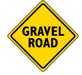

___ 
gravel road ahead

### What does this sign tell you? 

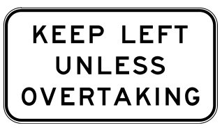

___ 
Keep left unless overtaking

### What does this sign tell you? 

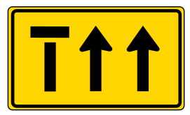

___ 
Left lane ends ahead - merge to right lanes 

### What does this sign tell you? 

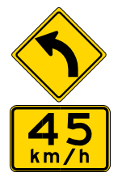

___ 
Should travel at 45 km/h when turning

### What does this sign tell you? 

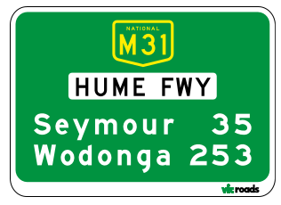

___ 
- Travelling on m31
- Hume Freeway
- Seymour in 35 km
- Wodonga in 253 km

### What does this sign tell you? 

___ 
pedestrian crossing ahead

### What does this sign tell you? 

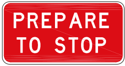

___ 
prepare to stop ahead

### What does this sign tell you? 

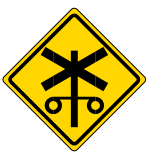

___ 
Rail crossing ahead

### What does this sign tell you? 

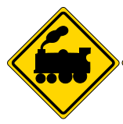

___ 
Rail crossing ahead

### What does this sign tell you? 

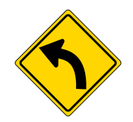

___ 
Road bend ahead 

### What does this sign tell you? 

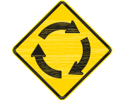

___ 
Roundabout ahead

### What does this sign tell you? 

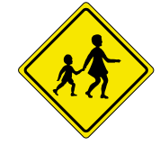

___ 
School children crossing ahead

### What does this sign tell you? 

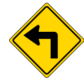

___ 
Sharp turn ahead 

### What does this sign tell you? 

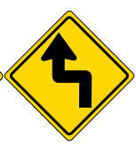

___ 
Sharp turn ahead 

### What does this sign tell you? 

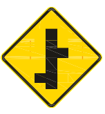

___ 
Side road intersection

### What does this sign tell you? 

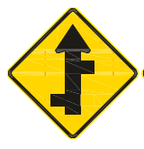

___ 
Side road intersection

### What does this sign tell you? 

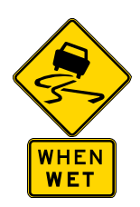

___ 
Slippery when wet

### What does this sign tell you? 

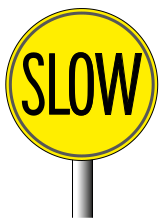

___ 
Slow down

### What does this sign tell you? 

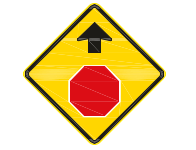

___ 
Stop sign ahead

### What does this sign tell you? 

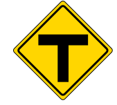

___ 
T intersection

### What does this sign tell you? 

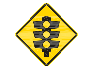

___ 
Traffic light ahead

### What does this sign tell you? 

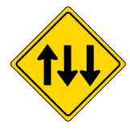

___ 
Two lane incoming traffic ahead

### What does this sign tell you? 

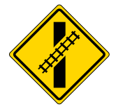

___ 
Uncontrolled rail crossing

### What does this sign tell you? 

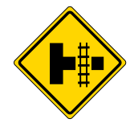
___ 
Uncontrolled rail crossing on side road

### What does this sign tell you? 

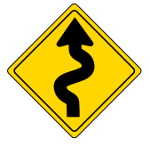
___ 
Winding road ahead

### What does this sign tell you? 

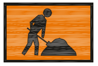
___ 
Worker ahead

### Can you cross broken lines to enter or leave the road?

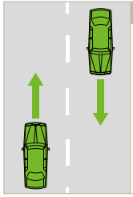

___
Yes 

### Can you overtake or do a U-turn on road with broken lines? 

___
Only if it is safe and the road ahead is clear

### Can you cross a single continuous white line to enter or leave the road?

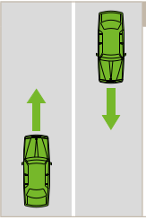

___
Yes 

### Can you overtake or do a U-turn on road with a single continuous white line? 

___
No 

### When can you cross a single continuous white line? 

___
- Pass a bicycle 
- Road ahead is clear 
- Safe to do so

### Can you cross a double continuous white line to enter or leave the road? 

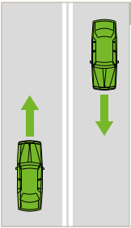

___ 
No

### Can you cross a double continuous white line to overtake a motor vehicle? 

___ 
No

### When can you cross a double continuous white line? 

___ 
- Briefly to pass a bicycle 
- Road ahead is clear
- Safe to do so 

### Can you cross a single continuous line to the left of a broken line to enter or leave the road? 

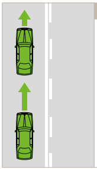

___
Yes 

### Can you overtake or make a U-turn on a single continuous line to the left of a broken line? 

___
No

### When can you cross a a single continuous line to the left of a broken line?

___ 
- Briefly to pass a bicycle 
- Road ahead is clear
- Safe to do so 

### Can you cross a broken line to the left of a continuous line to enter or leave the road? 

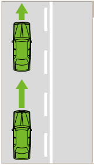

___
Yes 

### Can you overtake or make a U-turn on a a broken line to the left of a continuous? 

___
Yes but only when the road is clear and when it is safe to do so

### When can you park on the same side of a road as a continuous white dividing line? 

___
Must give 3m of clearance

### What does this traffic signal say? 

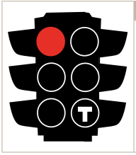

___
- Tram may go 
- You must wait 

### What does this overhead lane signal say? 

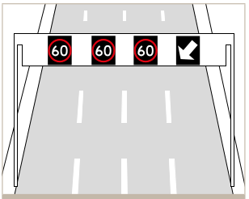

___
- Change lane if you are travelling on the lane with the change lane marking - lane is closed ahead

### What does this overhead lane signal say? 

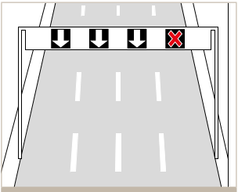

___
Must not drive past the point on the lane with red cross 

### When overhead lane signal is in use, what lanes should you travel in? 

___
- Speed limit sign 
- Green or white arrow 

### For road without marked lane, can you change from one line of traffic to another? 

___
- Yes 
- Signal 
- Safe to do so 

### For road without marked lane, can you overtake a vehicle from the left? 

___
- Yes 
- If that vehicle is turning right 
- Or if that vehicle is stationary
- Safe to do so 

### What are special purpose lane? 

___

Bus lane, bicycle lane, tram lane, transite lane

### Can car drive on special purpose lane? 

___
- If there are sign and marking - outside of the time marked on the sign 
- If there are no sign - cannot enter at any time

### When can cars drive on special purpose lane? 

___
- Briefly for 100 m (50 m for bicycle and tram lanes)
- To enter or exit the road 
- To avoid an obstruction or turning vehicle
- Must give way before entering special purpose lane 

### What is the maximum distance you can drive on bus lane or transit lane if not permitted (special purpose)?

___
100 m 

### What is the maximum distance you can drive on tram or bicycle lane if not permitted (special purpose)? 

___

50 m 

### Can you park on a bike lane? 

___

Yes unless prohibited by sign.

### What are transit lanes? 

___

During time specified on the sign, transit lanes are for buses, taxis, trams and vehicles that carry more than 2 or 3 people.

### When the arrow painted on the road points at 2 directions, where can you go? 

___
Either of the direction pointed by the arrow 

### When the arrow on the road points at 1 direction, where can you go? 

___
Must follow the arrow 

### What is a bicycle storage area? 

___

Designated area for bicycle at intersection to make them more visible 

### Where must driver stop at intersetion on the road with bicycle storage area? 

___ 

- Stop at the first line 
- Must not proceed until light changes 

### What are painted traffic islands and what are their purposes? 

___

- Painted area before a right turn lane.
- Drive over the painted islane to stop or wait on it, as long as there are no double lines outlining the island on the left. 
- Driver from painted islands must give way to all traffic in a turning lane or entering the turning lane.

### Who must give way and why? 

___
- B gives way 
- Vehicles in painted islane must giveway to vehicles entering turning lane.

### Who must give way and why? 

___
- B gives way 
- Give way sign

### Who must give way and why? 

___
- B must stop and give way
- Stop sign

### Who must give way and why? 

___
- B must give way.
- Driving from painted island.

### What must you do when entering freeway?

___
- Adjust your speed to freeway traffic
- Clearly indicate your intention
- Give way to traffic on freeway
- Merge safely when there is a large gap

### What should you do to exit the freeway? 

___
- Watch for signs that tell you the exit lane 
- Maintain your speed and signal intention
- Adjust speed once entering the exit ramp

### What should you do if you miss the exit on freeway? 

___ 
Continue travelling until the next exit 

### Can you reverse on freeway? 

___
No

### Can you cross the median strip to U turn on a free way? 

___
No

### Can you drive on the right lane on freeway? 

___

No stick to the left unless overtaking or unless all lanes are congested

### Can you stop on the freeway? 

___

- No unless it is an emergency 
- If you have to, use an emergenc stopping lane 
- Put on hazard warning light

### What should you do if your car breaks down in tunnel? 

___
- If possible drive outside of the tunnel.
- If cannot exit - stop on left or right lane, not middle lane.
- Switch on hazard light and radio
- Remain in the vehicle

### Can you stop in a tunnel if it is not an emergency? 

___
No

### Can you reverse in a tunnel? 

___
No

### Should you change lane in a tunnel? 

___
Legal but should avoid 

### Should you turn on headlights in a tunnel? 

___ 
Yes 

### Should you turn on radio in a tunnel? 

___
Yes

### When must a car give way to pedestrian? 

___
- At pedestrian crossing 
- At slip lane 
- At intersection when turning left or right 
- At children crossing 
- On foot path - when a car enters a road from driveway or adjacent land 
- In shared zone 
- At stop or give way signs or lines not at intersections
- When making U turn 
- At tram stop

### When making a U turn, who should you give way to? 

___
To all vehicles and pedestrians

### When at stop or give way sign, who should you give way to? 

___
To all vehicles and pedestrians

### When you enter the road from drive way or adjacent land, who should you give way to? 

___
To all vehicles and pedestrians 

### Where should you stop before a stopped tram? 

___
- Stop at the rear of the tram to give way to pedestrians
- Must not proceed while the doors are stil open 

### Who should give way and why? 

___
- Car
- Give way to pedestrian at slip lane

### Who should give way and why? 

___
- Car
- Give way sign

### Who should give way and why? 

___
- Car B
- Stop sign

### Who has right of way? 

- [ ] Vehicle A turning left from slip lane 
- [ ] Vehicle B going straight after waiting at stop sign

___
Vehicle B

### Who has right of way? 

- [ ] Vehicle A going straight after waiting at stop sign
- [ ] Vehicle B turning right also facing a Stop or Give Way sign

___
Vehicle A 

### Who has right of way? 

- [ ] Vehicle A going straight after waiting at stop sign 
- [ ] Vehicle B making a U turn

___
Vehicle A 

### Who has right of way? 

- [ ] Vehicle A facing a Give Way sign 
- [ ] Vehicle B turning right 

___
Vehicle B

### Who has right of way: 

Intersection with no traffic light 

- [ ] Car A turning right 
- [ ] Car B going straight on the right hand of A 

___
Car B since A must give way to vehicle on its right

### Who has right of way: 

Intersection with no traffic light 

- [ ] Car A going straight 
- [ ] Car B going straight 

A is on the right of B
___
Car A 

### Who should give way and why? 

___
- Car B
- A is on RHS at no traffic light

### Who should give way and why? 

___
- Car B
- A is on RHS at no traffic light

### Who should give way and why? 

___
- Car B
- A is on RHS at no traffic light

### Who should give way and why? 

___
- Car B
- A is on RHS at no traffic light

### Who should give way and why? 

___
- Car B
- A is on RHS at no traffic light

### Who should give way and why? 

___
- Car B
- A is on RHS at no traffic light

### If you are turning right at an intersection without traffic light, who should you give way to? 

___
- Vehicles going straight 
- Vehicles on your right
- Vehicles turning left (except for vehicles turning left from slip lane)

### Who has right of way? 

Intersection without traffic light 

A and B are on opposite roads such that they are turning onto the same lane

- [ ] Vehicle A is turning right 
- [ ] Vehicle B is turning left

___
Vehicle B since a vehicle turning right on a road without traffic light must give way to vehicle turning left 

### Who has right of way? 

Intersection without traffic light 

A and B are on opposite roads such that they are turning onto the same lane

- [ ] Vehicle A is turning right 
- [ ] Vehicle B is turning left from slip lane

___
Vehicle A

### What is a T intersection 

___

Where 2 roads meet and 1 ends 

### What is the give way rule for vehicles at T intersections? 

___ 

Vehicles from ending road must give way to vehicles on continuing road.

### Who should give way and why? 

___
- Car B
- A is on continuing road, B is from ending road to continuing road

### Who should give way and why? 

___
- Car B
- A is on continuing road, B is from ending road to continuing road

### Who should give way and why? 

___
- Car B
- A is on continuing road, B is from ending road to continuing road

### Who should give way and why? 

___
- Car B
- A is on continuing road, B is from ending road to continuing road

### Who should give way and why? 

___
- Car B
- A is on continuing road, B is from ending road to continuing road

### Who should give way and why? 

___
- Car B
- Here continuing road is modified to be curved. Ending road is marked. 
- Car A is on continuing road. Car B is entering ending road.

### Who should you give way to in a roundabout? 

___
- Vehicles already in the roundabout 
- All trams entering or approaching the roundabout 

### Who should give way and why? 

___
- Car B
- B are entering the roundabout and must give way to A which are already in the roundabout

### Who should give way and why? 

___
- Car B
- Give way sign

### Who must you give way to when changing lane? 

___
Vehicles in the lane that you are changing to

### What is a zip merge and who should give way? 

___
- Two lanes merged into one without road marking 
- Vehicle with any part ahead

### Who should give way and why? 

___
- Car B
- Zip merge and A is ahead

### Who should give way and why? 

___ 
- Car B 
- Changing lane 

### Does this situation count as zip merge and who should give way? 

___ 
- Changing lane
- Car B 

### What lane should you use for going straight in a roundabout? 

- [ ] Left
- [ ] Right 

___
Left 

### What lane should you use for going left in a roundabout? 

- [ ] Left 
- [ ] Right 

___
Left 

### What lane should you use for going right or turn around in a roundabout? 

- [ ] Left 
- [ ] Right 

___ 
Right 

### How long must you signal before turning? 

___
At least 5 seconds

### What does this sign say? 

___
Hook turn

### Can bicycle make a hook turn? 

___ 
Yes unless prohibited by signs 

### Can drivers make a hook turn from the right lane? 

___

No left lane only 

### Describe the steps for performing a hook turn? 

___
- Start from the left lane 
- Stay at the left most position of the road, positioned at the turning road. 
- Let vehicles going straight pass 
- Turn right when the light of the entering road turns green.

### When should you not make a U turn 

___
- Over a single continuous white line 
- Over double continuous white line 
- When there is a no U turn sign
- When there is a no right turn sign unless there is a U turn permitted sign 

### How should you make a U turn when there is no median? 

- [ ] Left
- [ ] Right
___
From the left side of the road 

### How should you make a U turn when there is a median? 

- [ ] Left
- [ ] Right
___
From the right side of the road 

### When turning from a one way to a two way road, how should you position your car? 

___

Close to the lane you are turning to

### When turning from a two way to a one way road, which lane should you take?

___
The lane closest to you

### How long should you signal before turning? 

___
At least 30 m in a 60 km/h zone. About 2 houses. Also at least 5 seconds 

### What is wrong with the following picture ?

___
Car A signal can be misleading

### When should you use your headlights? 

___
- Between sunset and sunrise 
- Poor visibility/tunnel

### How should high-beam be positioned? 

___
Dipped to the road when there is an incoming car at 200 m away.

### How should you respond when dazzled by high beam? 

___
Pull over until recovered 

### What should you do when another vehicle is overtaking you? 

___
Maintain your speed 

### If you want to overtake another driver who is driving at the speed limit, should you accelerate beyond the speed limit? 

___
No

### What are the steps you should do to overtake another vehicle driving at the speed limit? 

___
You cannot accelerate beyond speed limit

### What should be the gap between your car and a travelling bicycle on the road? 

___
- Up to 60 km/h - 1 m 
- Above 60 km/h - 1.5 m

### Can you pass the center line to pass bicycle? 

___
Yes when it is safe to do so 

### What is the speed limit at shared zone? 

___
10 km/h

### What is a safety zone? 

___
Area near a tram stop. Must slow down.

### When can you overtake a stopped tram? 

___
- If there are no pedestrian on the road
- Tram doors are closed 
- Or tram employee signals to go through 
- Must pass at speed 10 km/h 

### Can you pass tram on the right? 

___
No unless tram track is at the far left 

### You must treat buses travelling along tram track as a tram? 

- [ ] True 
- [ ] False 

___
True 

### What do the broken yellow lines next to tram track represent? 

___
- It means tram has priority 
- You may cross the broken line to turn, but must give way to tram 
- If you want to turn right, must wait until the tram passes 
- Do not pull out in front of the tram 
- Do not delay the tram 

### What is a tram lane? 

___
A single continuous yellow line near the tram track along the left side with a Tram Lane sign

### What are full time tram lanes?

___
Tram lanes without time on Tram Lane sign

### Are you allowed to travel in a full time tram lane? 

___
- No 
- Can use over a short distance (50m) to overtake a bicycle, enter or leave the road, or to avoid turning vehicle

### What are part time tram lanes? 

___

Tram lanes with time on Tram Lane sign

### Are you allowed to travel in a part time tram lane? 

___
- Yes outside of the hour of operation
- During operation, can use over a short distance (50m) to overtake a bicycle, enter or leave the road, or to avoid turning vehicle
- Must not delay the tram even outside the hour of operation

### What is a tramway? 

___

Double continuous yellow line near tram track

### Can you drive in tramway? 

___

Must not unless to avoid an obstacle - must be quick and not delay the tram

### Can you travel in bus lane? 

___
- If bus lane has time indicator - outside the hours
- May use briefly to enter or exit the road or to avoid obstacle

### What does this sign say?

___
- This lane is bus only.
- May not use unless for avoiding obstacle

### What does this sign say? 

___
Give way to bus pulling out from the kerb

### How should you approach police and other emergency vehicles? 

___
- Slow down when approach stationary of slow moving emergency vehicle with flashing light
- When pass, should not exceed 40 km/h

### You are crossing an intersection at greenlight. A police car is approaching with siren on from the road facing red light. Who has right of way? 

- [ ] You
- [ ] The police 

___
The police.

### How should you approach a horse? 

___
Slow down and leave space for unexpected movements by the horse 

### What does this sign say? 

___
Give way to stock animals 

### What does this sign say?

___
Stock animal crossing ahead. Must slow down the avoid collision and give way to crossing animals.

### How should you park in a parking bay that is not marked?

___
Leave 1 m between you and the vehicles in front and behind 

### What angle should you park your car? 

___

45 degree

### Can you reverse from a center of road parking? 

___

No 

### How long can you park your car here? 

___

No time limit 

### How long can you park your car here? 

___

1 hour in the signed hours
No limit outside the hours

### What does this sign say? 

___

No parking 

### What is the condition for no parking sign 

___

Allowed for 

- 2 minutes 
- < 3 m away from vehicle 
- Picking up or dropping of people and goods 

### When can you stop at a no parking sign? 

- [ ] Stop but stay in the car 
- [ ] Stop with hazard light on 
- [ ] At most 2 minutes when you are 3 m away from the car to pick up or drop off people and goods 

___

C 

### What does the sign say? 

___

No stopping 

### What do continuous yellow lines mean? Can you park next to a continuous yellow line? 

___

No parking

### What does the sign say? 

___ 

Clear way 

### What is the condition of the clear way sign? 

___

Cannot stop or park withint the alloted period 

### What does this sign say? 

___

For authorised:

- Vehicles carrying goods - signed delivery and couriers 
- Taxis

### Can loading/unloading vehicles park near this sign? 

___

No unless authorised by VicRoads

### What does this sign say? 

___

For vehicles that are >= 4.5 tonnes

### What does this sign say? 

___

For bus parking 

### What does this sign say? 

___

For taxis parking 

### What does this sign say? 

___

For vehicles with permits given by council 

### What does this sign say? 

___

For working vehicles near the site 

### What does the sign say? 

___
Vehicles parked here will be towed in the alloted period

### What is double parking? 

___

Parking in parallel to a car already parked at the kerb - illegal

### Can you park within the intersection? 

___
No unless on the continuing road of a T section.

### Can you park your car on the freeway? 

___
No

### Can you park away from the road for less than 3 m of clearance? 

___ 
No

### What is the minimum distance your car must be visible by when park in a curve outside build up area? 

___ 
100 m 

### How far away from the intersection with traffic light must you park your car? 

___ 
20 m 

### How far away from the intersection without traffic light must you park your car? 

___ 

10 m

### How far away from Aus Post mail box or a fire hydrant must you park your car? 

___

3 m 

### You park at the side of the road. You leave three metres of the road clear. Which road lines are you allowed to park opposite?

- [ ] A continuous yellow line at the side of the road 
- [ ] Continuous double white lines at the center of the road 
- [ ] A broken white line in the center of the road 

___

A broken white line 

### Can you park opposite to continuous double white lines with 3 m clearance? 

___ 

No

### Who must you give way to and why? 

___

- Give way to C due to give way sign 
- Do not need to give way to B since B also faces give way sign

### Who has right of way and why?

___

Car B since A is changing lane

### You are driving in this position when the tram slows down and stops at a tram stop. What should you do?

___
Stop 

### Who can overtake in this situation? 

___

A

### You are driving vehicle A and want to turn right. Vehicle B is indicating left. What should you do?

___

Wait to see what B does. B might have signaled too early

### You are driving vehicle A. When can you complete a hook turn?

___

When the traffic light of the turning road turns green

### You are driving vehicle A. Which path must your vehicle take?

___

Path I

### What is the correct give way sequence of all vehicles? 

___

- B, A, C
- B > A since B is on the right of A 
- A > C since A is travelling from continuing road, C from ending road.

### In which of these diagrams does vehicle A have to give way to vehicle B?

___

II only. In I, A is performing a zip merge and has priority (ahead of B). In II, A is performing a U turn and must give way to B.

### You are driving vehicle A. You must give way to

___
Both pedestrians since you are driving from drive way.

### Which vehicle must give way to a pedestrian?

___

Both vehicles

